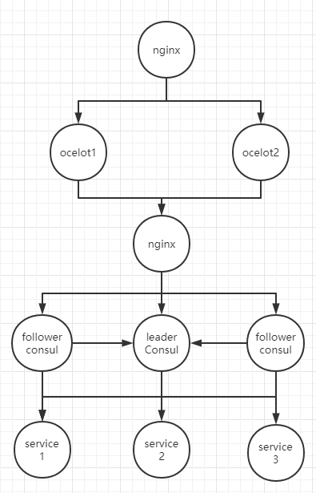

[](#) 

# 分布式集群Demo
> 这是一个包含consul、ocelot、nginx的分布式集群Demo

## 架构图


## 配置
1、nginx配置(nginx.conf)consul和ocelot集群地址
```
upstream consul_pools {
    server 192.168.7.121:8501;
    server 192.168.7.121:8502;
    server 192.168.7.121:8503;
}

upstream ocelot_pools {
    server 192.168.7.121:9001;
    server 192.168.7.121:9002;
}
```
2、ocelot配置(configuration.json)consul集群的地址
```
"ServiceDiscoveryProvider": {
    "Scheme": "http",
    "Host": "192.168.7.121",
    "Port": 8500,
    "Type": "Consul"
}
```
3、service配置consul地址以及自己启动地址
```
{
  "ConsulAddress": "http://192.168.7.121:8500",
  "ServiceName": "MyServiceA",
  "HealthCheck": "/Health",
  "IP": "192.168.7.121",
  "Port":  "5001"
}
```

## 启动
```shell
# 先启动基础服务：consul、ocelot、nginx
docker-compose -f docker-compose.base.yml build  
docker-compose -f docker-compose.base.yml up -d  

# 启动微服务
docker-compose -f docker-compose.services.yml build  
docker-compose -f docker-compose.services.yml up -d  
```